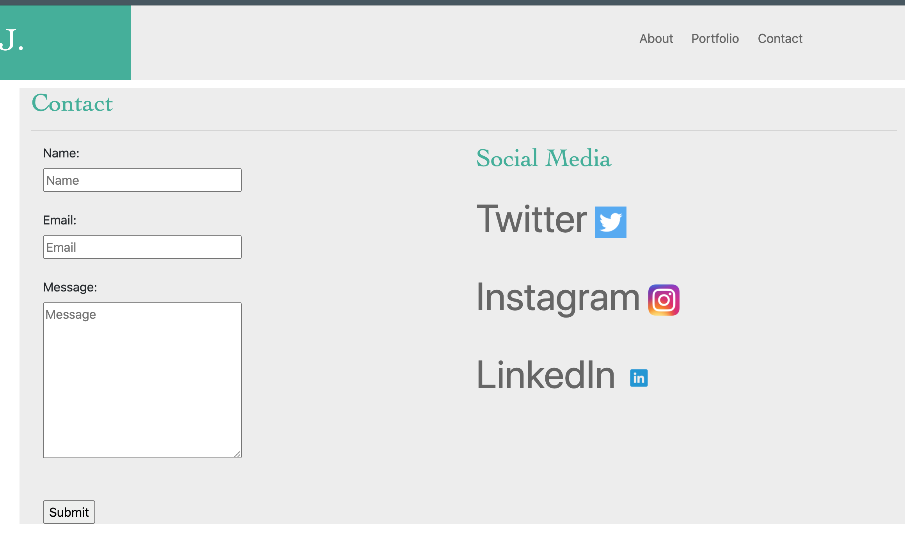

# Responsive Portfolio
We are tasked to architect and replicate a website with 3 pages within its contents. Those pages are a biography, contact page, and portfolio page. All pages must be created using bootstrap respectively. We are given a collage of images of the finished version of the website, that we are supposed to replicate with some of our own creative addition to it. The root of this website asesthetically, is bootstrap CSS. Bootstrap is used for its seemingly effecient grid and layout system. This allows web developers generate a plethora of content and images to be responsive in a single line of code. (Not really, but you get this gist.)
## Installing 
Located on https://getbootstrap.com/docs/4.0/getting-started/introduction/ you will find the HTML starter template that carries the proper CDN links to be able to use bootstrap CSS and bootstrap classifications.

## Site Picture 


## Code Snippet 
Starter Template:

```
<!doctype html>
<html lang="en">
  <head>
    <!-- Required meta tags -->
    <meta charset="utf-8">
    <meta name="viewport" content="width=device-width, initial-scale=1, shrink-to-fit=no">

    <!-- Bootstrap CSS -->
    <link rel="stylesheet" href="https://maxcdn.bootstrapcdn.com/bootstrap/4.0.0/css/bootstrap.min.css" integrity="sha384-Gn5384xqQ1aoWXA+058RXPxPg6fy4IWvTNh0E263XmFcJlSAwiGgFAW/dAiS6JXm" crossorigin="anonymous">

    <title>Hello, world!</title>
  </head>
  <body>
    <h1>Hello, world!</h1>

    <!-- Optional JavaScript -->
    <!-- jQuery first, then Popper.js, then Bootstrap JS -->
    <script src="https://code.jquery.com/jquery-3.2.1.slim.min.js" integrity="sha384-KJ3o2DKtIkvYIK3UENzmM7KCkRr/rE9/Qpg6aAZGJwFDMVNA/GpGFF93hXpG5KkN" crossorigin="anonymous"></script>
    <script src="https://cdnjs.cloudflare.com/ajax/libs/popper.js/1.12.9/umd/popper.min.js" integrity="sha384-ApNbgh9B+Y1QKtv3Rn7W3mgPxhU9K/ScQsAP7hUibX39j7fakFPskvXusvfa0b4Q" crossorigin="anonymous"></script>
    <script src="https://maxcdn.bootstrapcdn.com/bootstrap/4.0.0/js/bootstrap.min.js" integrity="sha384-JZR6Spejh4U02d8jOt6vLEHfe/JQGiRRSQQxSfFWpi1MquVdAyjUar5+76PVCmYl" crossorigin="anonymous"></script>
  </body>
```
* This starter template allows the user to enable bootstrap functionality.

## Prerequisites
* No external software of any kind. links, CDN, and scripts are found within the starter template.
* However, you need the Assets/Images from the UCB repository for reference. 

# Built With 
* [HTML](https://developer.mozilla.org/en-US/docs/Web/HTML)
* [CSS](https://developer.mozilla.org/en-US/docs/Web/CSS)
* [Bootstrap](https://getbootstrap.com/docs/4.0/getting-started/introduction/)

## Deployed Link 
- [Link to Github repository](https://github.com/Kionling/responsive-portfolio1)
- [Link to deployed website](https://kionling.github.io/responsive-portfolio1/)
## Authors 
* **Daniel Jauregui**
* [Author Page](https://kionling.github.io/responsive-portfolio1/index.html)

## Acknowledgments 
* [Bootstrap](https://getbootstrap.com/docs/4.0/getting-started/introduction/)
* [w3Schools](https://www.w3schools.com/)
